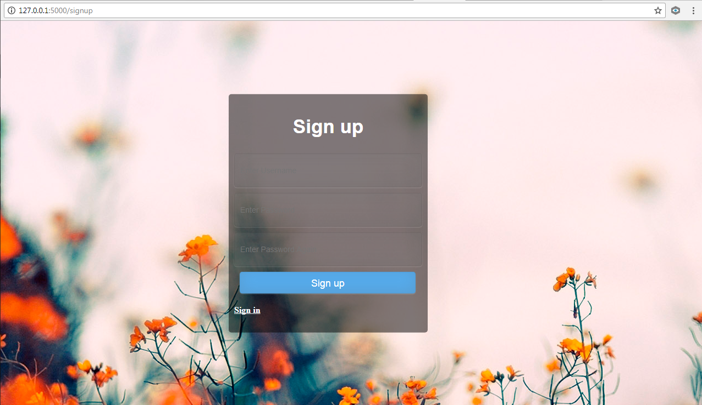
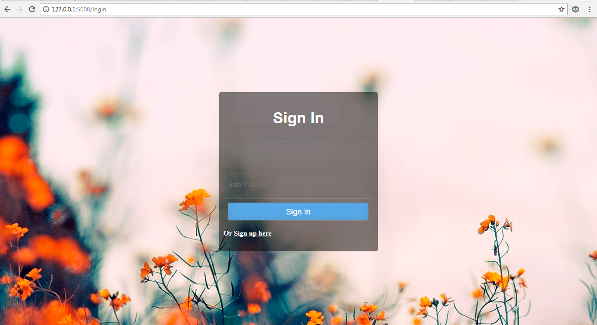

### Bright Events

Bright Events is an events management application.

### Installation and Setup

Clone the repository from GitHub:
```

$ https://github.com/anyieni/Bright-events.git

```

Fetch from the develop branch:
```

$ git fetch origin develop

```

Navigate to the `bright-events` directory:
```

$ cd bright-events

```

Create a virtual environment:
```

$ virtualenv env

```

Install the required packages:
```

$ pip install -r requirements.txt

```

Launch the program:
```

$ python run.py

```

Screenshots:

Signup Form



Login Form


